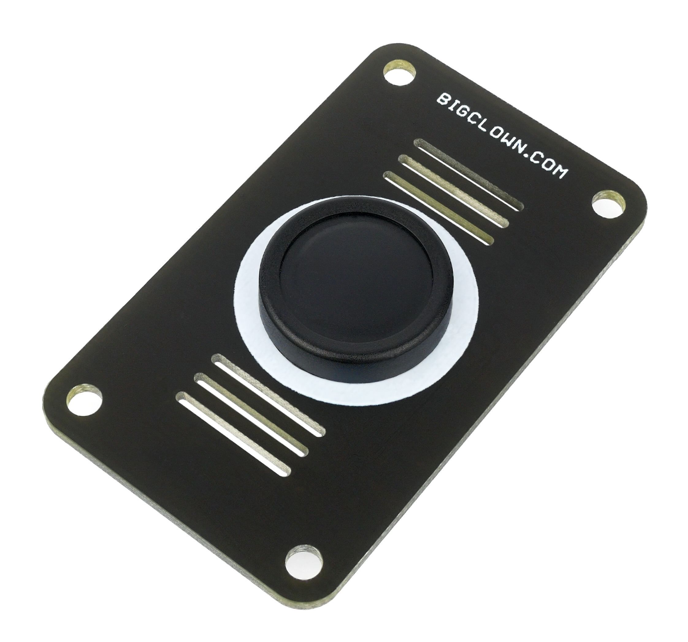

###################
About Button Module
###################

The **Button Module** is as simple as its name speaks. It has one large button that feels good to click.
You can use it to trigger various actions, e.g. turn on the light, send a push notification, or control an appliance.
It is connected to the BOOT signal on the **Core Module**.

+-------------------------------------------------------+--------------------------------------------------------------------------------------------------+---------------------------------------------------------------+----------------------------------------------------------------------------------------+----------------------------------------------------------------------------------------+
| `E-Shop <https://shop.hardwario.com/button-module/>`_ | `Schematic drawing <https://github.com/hardwario/bc-hardware/tree/master/out/bc-module-button>`_ | `SDK Library <https://sdk.hardwario.com/group__bc__button>`_  | `Header File <https://github.com/hardwario/bcf-sdk/blob/master/bcl/inc/bc_button.h>`_  | `Source File <https://github.com/hardwario/bcf-sdk/blob/master/bcl/src/bc_button.c>`_  |
+-------------------------------------------------------+--------------------------------------------------------------------------------------------------+---------------------------------------------------------------+----------------------------------------------------------------------------------------+----------------------------------------------------------------------------------------+

----------------------------------------------------------------------------------------------

********
Features
********

- Large and robust button for comfortable pressing
- Lifetime over one million clicks
- Operating temperature range: -20 to 60 °C
- Mechanical dimensions: 33 x 55 mm
- **3-year warranty**

