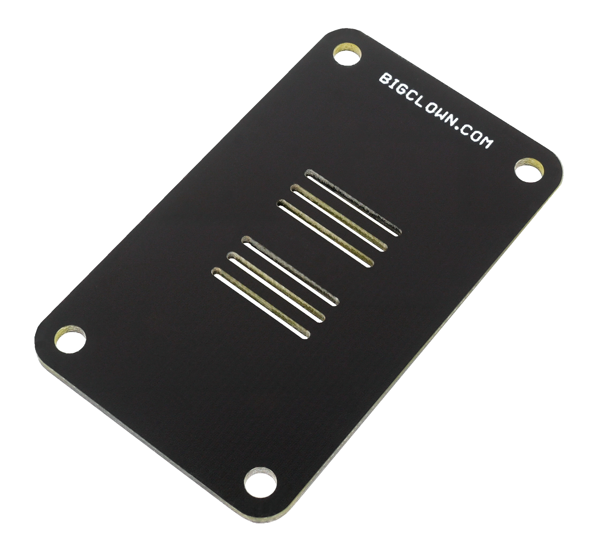

#######################
About Mini Cover Module
#######################

The **Mini Cover Module** is a simple mechanical part that helps to cover the front face of the HARDWARIO TOWER electronics (smaller format 33 x 55 mm).
It looks great when combined with one of our 3D-printed enclosure.
You simple snap it in the HARDWARIO TOWER socket header using the bottom pins.

+-----------------------------------------------------------+------------------------------------------------------------------------------------------------------+
| `E-Shop <https://shop.hardwario.com/mini-cover-module/>`_ | `Schematic drawing <https://github.com/hardwario/bc-hardware/tree/master/out/bc-module-cover-mini>`_ |
+-----------------------------------------------------------+------------------------------------------------------------------------------------------------------+

