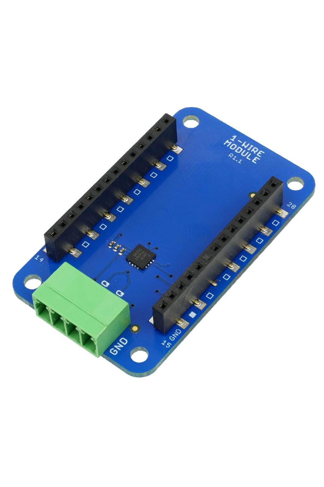

###################
About 1-Wire Module
###################

The **1-Wire** Module allow you to connect I²C devices over a distance of several meters.
The I²C protocol is encapsulated to a 1-Wire protocol. The data are protected using **16-bit CRC**.
You can use the **Sensor Module** to create a 1-Wire bus master.

********
Features
********

- Integrated 1-Wire to I²C master bridge DS28E17 (Maxim)
- Operating voltage range: 2.5 V to 3.6 V
- Operating temperature range: -20 to 70 °C
- Mechanical dimensions: 33 x 55 mm

*********
Resources
*********

- `E-Shop <https://shop.hardwario.com/1-wire-module/>`_
- `Schematic drawing <https://github.com/hardwario/bc-hardware/tree/master/out/bc-module-1-wire>`_
- `SDK Library <https://sdk.hardwario.com/group__bc__onewire>`_
- `Header File <https://github.com/hardwario/bcf-sdk/blob/master/bcl/inc/bc_onewire.h>`_
- `Source File <https://github.com/hardwario/bcf-sdk/blob/master/bcl/src/bc_onewire.c>`_
