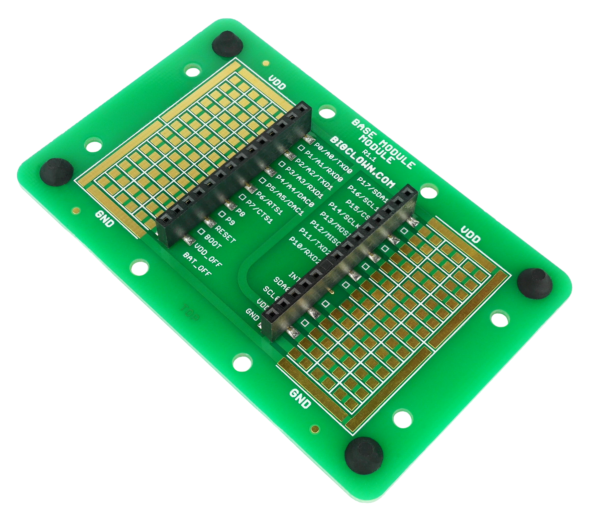

#################
About Base Module
#################

The **Base Module** works as a mechanical stand for the HARDWARIO units.
With the exception of the **Battery Module**, you can plug any other HARDWARIO IoT Kit module into a standardized socket available on the **Base Module**.
It also features a **prototyping area** for soldering your circuits.

This module can be used as a stand on a desk (four rubber feet assure stable position on a surface),
mounted on a **DIN rail** using special plastic clips, or it can be put on a wall or other vertical surfaces using a double-sided tape.

+-------------------------------------------------------+--------------------------------------------------------------------------------------------------+
| `E-Shop <https://shop.hardwario.com/base-module/>`_   | `Schematic drawing <https://github.com/hardwario/bc-hardware/tree/master/out/bc-module-base>`_   |
+-------------------------------------------------------+--------------------------------------------------------------------------------------------------+

********
Features
********

- Useful stand for the HARDWARIO module system
- Prototyping area for soldering custom circuits
- Rubber feet (included)
- Plastic clips for a DIN rail mount (optional accessory)
- Operating temperature range: -20 to 70 °C
- Mechanical dimensions: 88 x 55 mm
