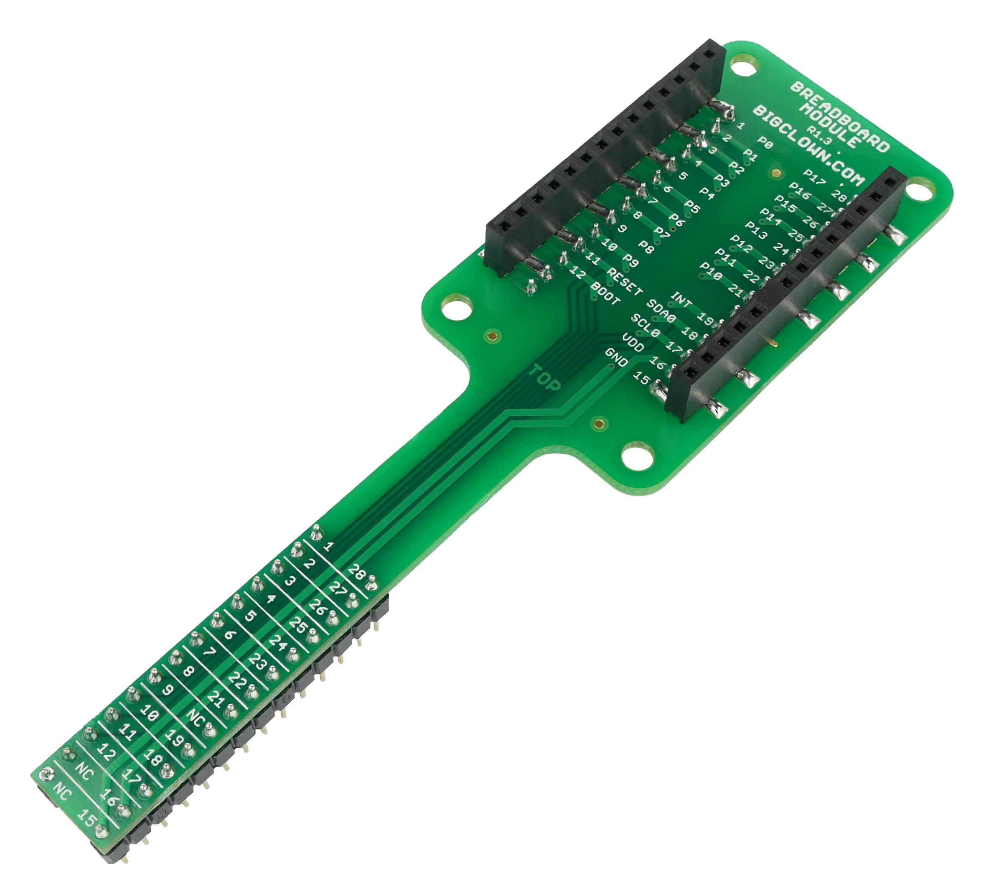

#######################
About Breadboard Module
#######################

The **Breadboard Module** offers an easy way to connect any HARDWARIO IoT Kit module to your breadboard.
The narrowed breakout provides more space for wiring and prototyping.
The precision pin headers from the bottom side allow smooth insertion to your breadboard and do not stress the breadboard's sockets.

********
Features
********

- Break-out adapter between HARDWARIO modules and breadboard
- Precision pin headers optimized for breadboard sockets
- Operating temperature range: -20 to 70 °C
- Mechanical dimensions: 114 x 33 mm

*********
Resources
*********

- `E-Shop <https://shop.hardwario.com/breadboard-module/>`_
- `Schematic drawing <https://github.com/hardwario/bc-hardware/tree/master/out/bc-module-breadboard>`_
