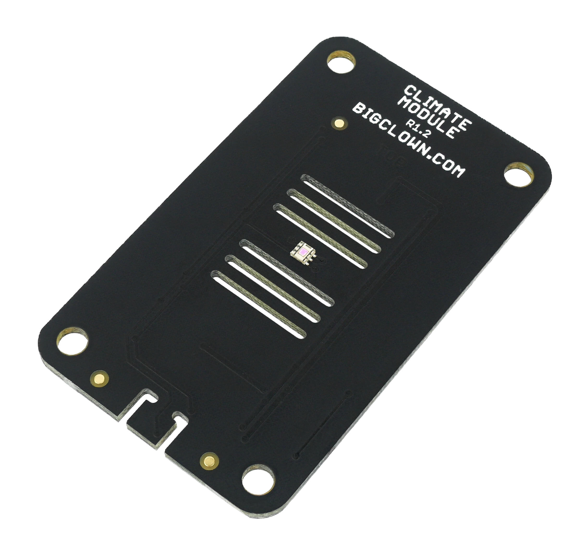

####################
About Climate Module
####################

The **Climate Module** integrates 4 environmental sensors - **temperature, humidity, light intensity and atmospheric pressure.**
All sensors are digital, feature low-power operating modes and connected by using the I²C bus.
It is a great product for environmental monitoring, weather stations, etc.

You can use the **Climate Module** altogether with the **Mini Battery Module** and the **Core Module** to create a very compact wireless environmental sensor.

+--------------------------------------------------------+---------------------------------------------------------------------------------------------------+-----------------------------------------------------------------------+-----------------------------------------------------------------------------------------------+-----------------------------------------------------------------------------------------------+
| `E-Shop <https://shop.hardwario.com/climate-module/>`_ | `Schematic drawing <https://github.com/hardwario/bc-hardware/tree/master/out/bc-module-climate>`_ | `SDK Library <https://sdk.hardwario.com/group__bc__module__climate>`_ | `Header File <https://github.com/hardwario/bcf-sdk/blob/master/bcl/inc/bc_module_climate.h>`_ | `Source File <https://github.com/hardwario/bcf-sdk/blob/master/bcl/src/bc_module_climate.c>`_ |
+--------------------------------------------------------+---------------------------------------------------------------------------------------------------+-----------------------------------------------------------------------+-----------------------------------------------------------------------------------------------+-----------------------------------------------------------------------------------------------+

********
Features
********

**Temperature sensor TMP112 (TI)**

- Measurement accuracy (typical):
    - ± 0.1 °C at 25 °C
    - ± 0.25 °C in the range 0 °C to 65 °C
    - ± 0.5 °C in the range -40 °C to 125 °C
- 12-bit resolution (0.0625 °C)
- Milling around the sensor for faster temperature response
- Operating current: 7 μA (4 Hz sampling)
- Standby current: 2 μA

**Relative humidity sensor SHT20 (Sensirion)**

- Measurement range: from 0 % to 100 %
- Measurement accuracy (typical): ±2 %
- Operating current: 10 μA

**Atmospheric pressure sensor MPL3115A2 (NXP)**

- Measurement range for pressure: 20 kPa to 110 kPa
- Measurement range for altitude: -698 to 11,775 m
- Measurement accuracy: ± 0.4 kPa
- Operating current: 40 μA (1 Hz period)
- Standby current: 2 μA

**Light intensity sensor OPT3001 (TI)**

- Measurement range: from 0.01 to 83,000 lux
- 23-bit dynamic range
- Operating current: 1.8 μA
- Standby current: 0.3 μA

**Common features**

- All sensors communicate using I²C bus
- Operating voltage range: 1.6 V to 3.3 V
- Operating temperature range: -40 to 70 °C
- Dimensions: 33 x 55 mm

