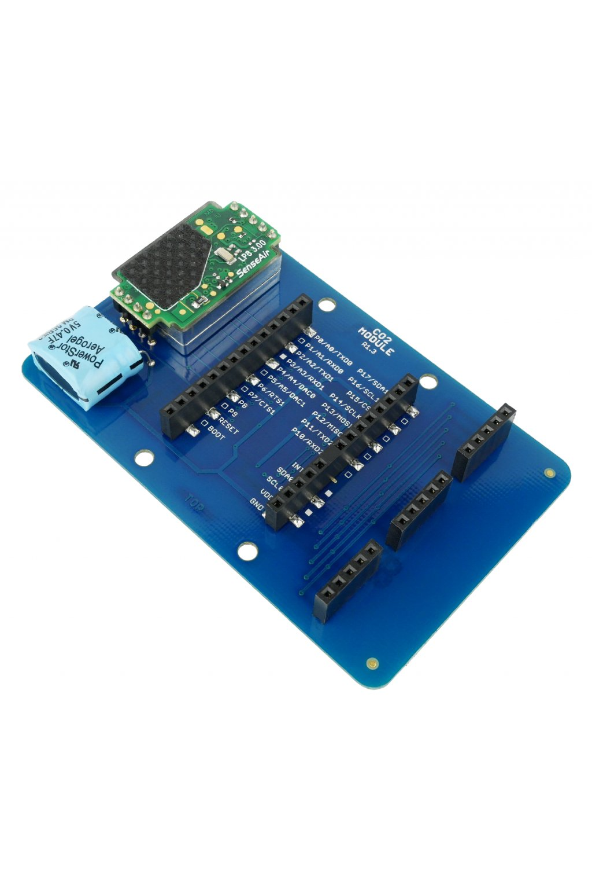

################
About CO2 Module
################

The **CO2 Module** is a gas sensor for measuring the **carbon dioxide (CO₂) concentration**.
This module achieves ±50 ppm accuracy. It uses a non-dispersive infrared (NDIR) sensor manufactured in Sweden.
Thanks to its **low-power operation** it can be powered from batteries for years.

Carbon dioxide (or CO₂) is a colorless and odorless gas that is vital to life on Earth.
Its nominal concentration is about 400 ppm (0.04 %). There are many occurrences of CO₂ in nature. For example humans produce CO₂ when exhaling.

.. important::

    The high concentration of CO₂ leads to acidity and various health related problems.

We have equipped the LP8 sensor with additional circuitry for efficient power management and I²C-only interfacing.
This module also features three 5-pin sockets allowing you to connect HARDWARIO tags.

********
Features
********

- Carbon dioxide (CO₂) sensor LP8 (SenseAir)
- Non-dispersive infrared (NDIR) technology
- Measurement range of CO₂: 0 to 10 000 ppm
- Measurement accuracy: ±50 ppm CO₂ ±3 % of reading (Note 1)
- I²C-only interface (integrated UART bridge and I/O expander)
- Constant current source for 470 mF supercap
- Long battery life-time
- 3 sockets for a HARDWARIO tag
- Low power consumption:
    - 6 µA (6 measurements per hour)
    - 61 µA (1 measurement per minute)
- Operating voltage range: 3 V to 3.6 V
- Operating temperature range: 0 to 50 °C
- Mechanical dimensions: 88 x 55 mm

.. caution::

    Accuracy ±50 ppm is achieved after 24 days of operation and auto calibration process.

*********
Resources
*********

- `E-Shop <https://shop.hardwario.com/co2-module/>`_
- `Schematic drawing <https://github.com/hardwario/bc-hardware/tree/master/out/bc-module-co2>`_
- `SDK Library <https://sdk.hardwario.com/group__bc__module__co2>`_
- `Header File <https://github.com/hardwario/bcf-sdk/blob/master/bcl/inc/bc_module_co2.h>`_
- `Source File <https://github.com/hardwario/bcf-sdk/blob/master/bcl/src/bc_module_co2.c>`_
