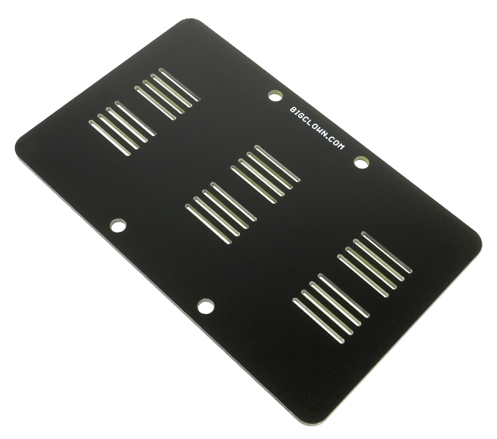

##################
About Cover Module
##################

The **Cover Module** is a simple mechanical part that helps to cover the front face of the HARDWARIO electronics (larger format 88 x 55 mm).
It looks great when combined with one of our 3D-printed enclosure.
You simple snap it in the HARDWARIO socket header using the bottom pins.

********
Features
********

- Aesthetic cover for the electronics
- Bottom pins for the standardized BigClown header
- Operating temperature range: -20 to 70 °C
- Mechanical dimensions: 88 x 55 mm

*********
Resources
*********

- `E-Shop <https://shop.hardwario.com/cover-module/>`_
- `Schematic drawing <https://github.com/hardwario/bc-hardware/tree/master/out/bc-module-cover>`_
