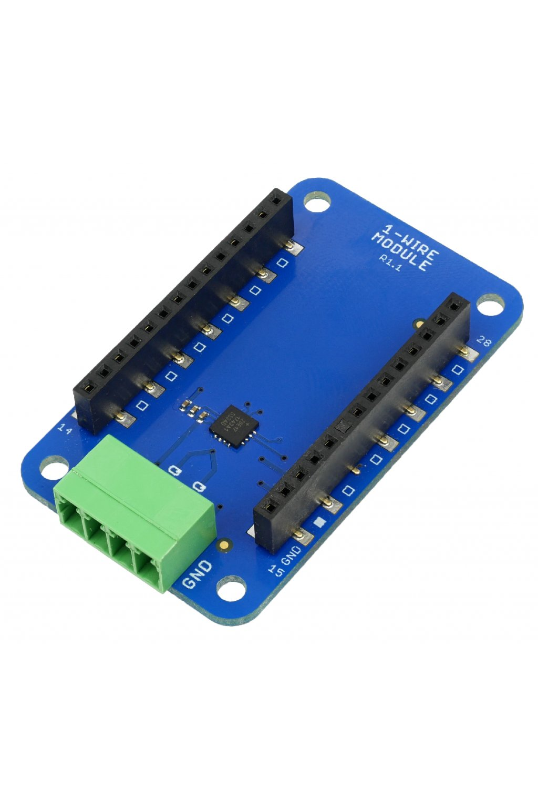

##################
About Radio Dongle
##################

The **Radio Dongle** is the main element of the HARDWARIO radio network.
This product works as a **gateway for the HARWDARIO nodes**. It looks like a USB stick.
You can plug it to your desktop, Raspberry Pi, or Turris Omnia.
Also, you can look at it as an access point for up to 32 HARDWARIO nodes.

This item is fully compatible with the **Core Module**. It has a **32-bit ARM microcontroller** with 192 kB of flash memory and 20 kB of RAM.
Besides the **integrated sub-GHz radio** for the 868/915 MHz band, it also features two security chips - to have enough space for up to 32 BigClown nodes.

.. note::

    You can upload firmware into it over USB using the HARDWARIO Firmware Tool (works on Windows, macOS, and Linux). Or by using HARDWARIO Playground.

********
Features
********

- ARM Cortex M0+ 32-bit MCU STM32L083CZ (ST)
- 192 kB Flash / 20 kB RAM
- Radio module (868/915 MHz) based on SPIRIT1 (ST)
- Dual security chip ATSHA204A (Microchip)
- USB to UART bridge FT231X (FTDI)
- Red color LED
- 10-pin SWD connector for debugging (not populated)
- USB-A connector for host communication and/or power
- Operating voltage range: 4.5 V to 5.5 V
- Operating temperature range: -20 to 70 °C
- Mechanical dimensions: 25 x 60 mm

*********
Resources
*********

- `E-Shop <https://shop.hardwario.com/radio-dongle/>`_
- `Schematic drawing <https://github.com/hardwario/bc-hardware/tree/master/out/bc-usb-dongle>`_
