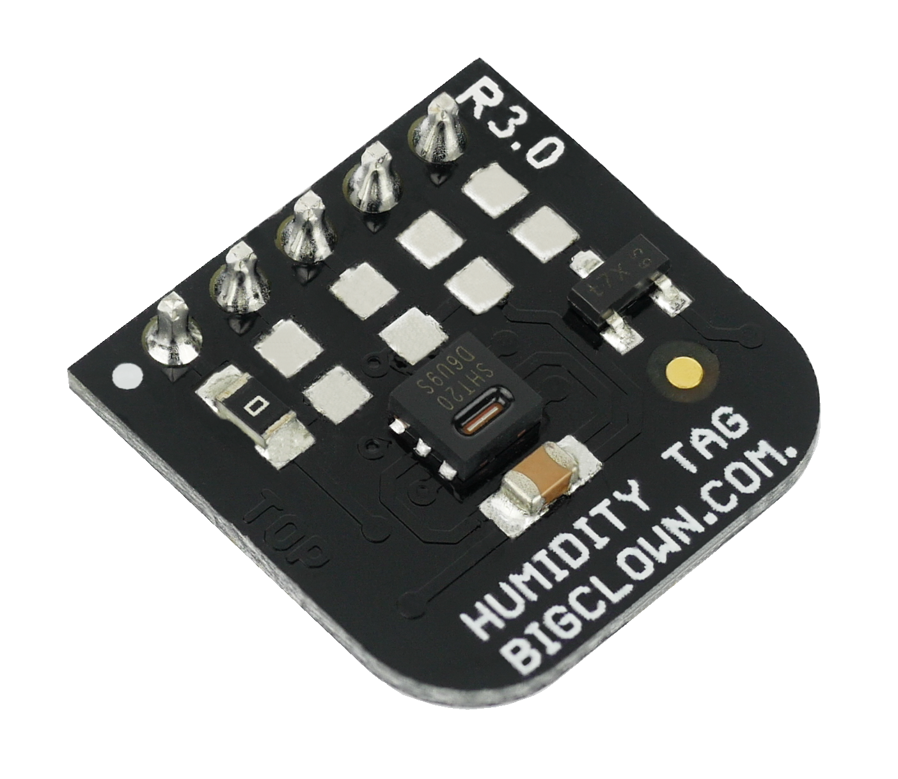

##################
About Humidity Tag
##################

The **Humidity Tag** uses a high-accuracy **humidity sensor** SHT20 with a typical accuracy of ±3 % from 20 % to 80 %.
This sensor is digital and calibrated.
It communicates using an I²C bus and features a very low power operation and shutdown mode.

.. tip::

    Relative humidity is the essential attribute of the environment we live in. The recommended indoor range is between 30 % and 60 %.

    Values below this range (dry air) can lead to various health issues. On the other hand, the values above this range may result in troubles with moisture.

+-------------------------------------------------------+--------------------------------------------------------------------------------------------------+---------------------------------------------------------------------+---------------------------------------------------------------------------------------------+---------------------------------------------------------------------------------------------+
| `E-Shop <https://shop.hardwario.com/humidity-tag/>`_  | `Schematic drawing <https://github.com/hardwario/bc-hardware/tree/master/out/bc-tag-humidity>`_  | `SDK Library <https://sdk.hardwario.com/group__bc__tag__humidity>`_ | `Header File <https://github.com/hardwario/bcf-sdk/blob/master/bcl/inc/bc_tag_humidity.h>`_ | `Source File <https://github.com/hardwario/bcf-sdk/blob/master/bcl/src/bc_tag_humidity.c>`_ |
+-------------------------------------------------------+--------------------------------------------------------------------------------------------------+---------------------------------------------------------------------+---------------------------------------------------------------------------------------------+---------------------------------------------------------------------------------------------+

----------------------------------------------------------------------------------------------

********
Features
********

- Integrated humidity sensor SHT20 (Sensirion)
- Communication using I²C bus
- Measurement range: 0 % to 100 %
- Measurement accuracy: ±2 %
- Optional interrupt output
- Operating current: 10 µA
- Operating voltage range: 1.8 V to 3.3 V
- Operating temperature range: -40 to 125 °C
- Mechanical dimensions: 16 x 16 mm

