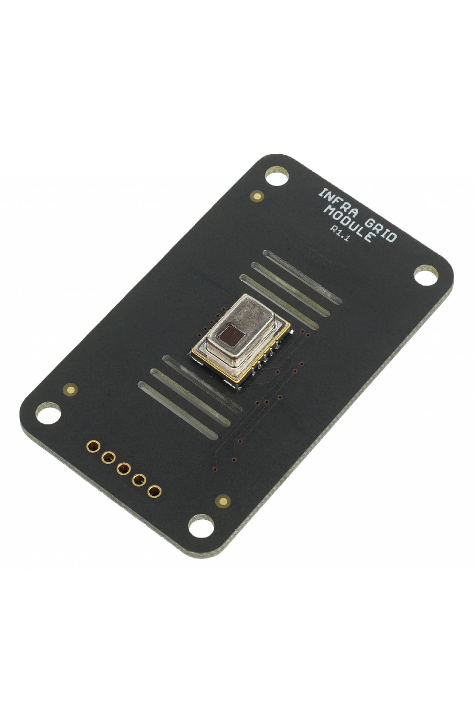

#######################
About Infra Grid Module
#######################

**Infra Grid Module** has 64 infrared temperature sensors in 8 by 8 matrix.
You can do non-contact infrared temperature measurement. Its using Panasonic Infrared Array Sensor Grid-EYE with AMG8833 chip.
You can detect not just movements but also the direction and size of the moving object.

********
Features
********

- Infrared images in 8 by 8 pixel resolution
- Operating voltage of 3.3 V
- Temperature accuracy ±2.5 °C
- Operating and measuring temperatures 0 °C to 80 °C (High gain sensor type)
- Human detection distance up to 7 m
- Current consumption of 4.5 mA in normal mode (10 FPS)
- Integrated power switch for low power operation.
- Integrated temperature sensor −20 °C to 80 °C

*********
Resources
*********

- `E-Shop <https://shop.hardwario.com/infra-grid-module/>`_
- `Schematic drawing <https://github.com/hardwario/bc-hardware/tree/master/out/bc-module-infra-grid>`_
- `SDK Library <https://sdk.hardwario.com/group__bc__module__infra__grid.html>`_
- `Header File <https://github.com/hardwario/bcf-sdk/blob/master/bcl/inc/bc_module_infra_grid.h>`_
- `Source File <https://github.com/hardwario/bcf-sdk/blob/master/bcl/src/bc_module_infra_grid.c>`_
