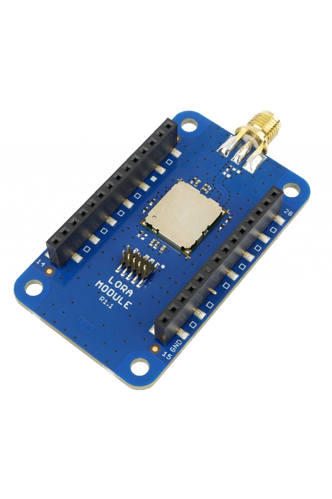

#################
About LoRa Module
#################

The **LoRa Module** allows you to communicate to the **LoRaWAN wireless network**, a network made for the IoT.
This technology makes it possible to communicate from a battery-powered device directly to server, even for several years.
The **LoRa Module** uses radio frequency 868 MHz.

The LoRa Module allows you to communicate to the LoRaWAN wireless network, a network made for the IoT.
This technology makes it possible to communicate from a battery-powered device directly to server, even for several years.
The LoRa Module uses radio frequency 868 MHz.

Thanks to specific zig-zag modulation, the LoRa device can communicate with the gateway over a distance of tens kilometers.

This network has a wide range of applications.
Its use is particularly useful in energy consumption meters (e.g. water meters, gas meters, etc.), environmental sensors (e.g. a CO₂ sensor),
but also in applications for early reports of accidents or defects (e.g. water leak detector).

+-------------------------------------------------------+--------------------------------------------------------------------------------------------------+------------------------------------------------------------------+-------------------------------------------------------------------------------------------+-------------------------------------------------------------------------------------------+
| `E-Shop <https://shop.hardwario.com/lora-module/>`_   | `Schematic drawing <https://github.com/hardwario/bc-hardware/tree/master/out/bc-module-lora>`_   | `SDK Library <https://sdk.hardwario.com/group__bc__cmwx1zzabz>`_ | `Header File <https://github.com/hardwario/bcf-sdk/blob/master/bcl/inc/bc_cmwx1zzabz.h>`_ | `Source File <https://github.com/hardwario/bcf-sdk/blob/master/bcl/src/bc_cmwx1zzabz.c>`_ |
+-------------------------------------------------------+--------------------------------------------------------------------------------------------------+------------------------------------------------------------------+-------------------------------------------------------------------------------------------+-------------------------------------------------------------------------------------------+

----------------------------------------------------------------------------------------------

********
Features
********

- LoRaWAN module CMWX1ZZABZ-078 (Murata)
- Communication using UART and AT commands
- SMA antenna ANT-SS900
- Standby power consumption 2 μA
- Operating voltage range: 1.8 to 3.6 V
- Operating temperature range: -20 to 70 °C
- Dimensions: 33 x 55 mm

