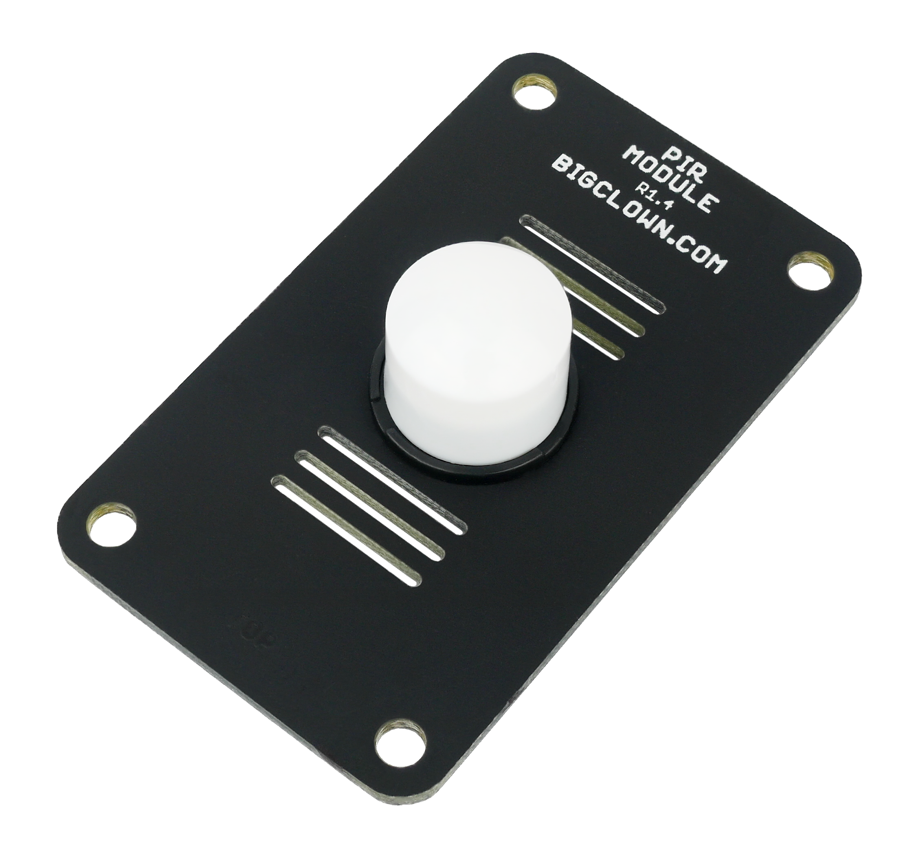

################
About PIR Module
################

The **PIR Module** works as a **motion detector** operating on a **passive infrared (PIR)** principle.
A typical usage of the **PIR Module** can be a wireless motion detector located on a wall or ceiling.
The module is equipped with an **ultra-low-power digital sensor** from Excelitas' the DigiPyro® family.

********
Features
********

- Digital PIR detector PYQ-1648-7053 (Excelitas)
- Fully digital processing (signal analysis takes place in the sensor)
- Four-element sensor type
- Omnidirectional lens Carclo Diamond 37
- Resolution of the internal A/D converter: 14-bit
- Detection angle: 98° (horizontally and vertically)
- Maximal detection range: 5 m
- Power consumption: approx. 3 μA
- Operating voltage range: 2.5 V to 3.6 V
- Operating temperature range: -20 to 70 °C
- Dimensions: 33 x 55 mm

*********
Resources
*********

- `E-Shop <https://shop.hardwario.com/pir-module/>`_
- `Schematic drawing <https://github.com/hardwario/bc-hardware/tree/master/out/bc-module-pir>`_
- `SDK Library <https://sdk.hardwario.com/group__bc__module__pir>`_
- `Header File <https://github.com/hardwario/bcf-sdk/blob/master/bcl/inc/bc_module_pir.h>`_
- `Source File <https://github.com/hardwario/bcf-sdk/blob/master/bcl/src/bc_module_pir.c>`_
