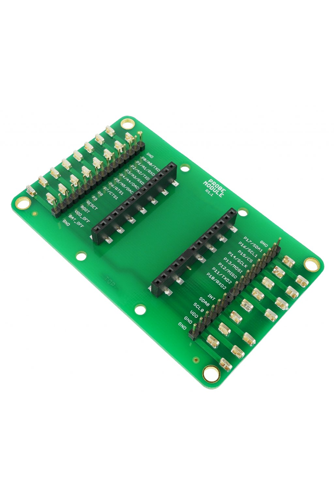

##################
About Probe Module
##################

The **Probe Module** allows you to easily hook up an **oscilloscope** or **logic analyzer** on any signal of the HARDWARIO IoT Kit header.
Sometimes during the development, you need to analyze the signals and see what's going on.
And this module makes the task fast and convenient.

+-------------------------------------------------------+--------------------------------------------------------------------------------------------------+
| `E-Shop <https://shop.hardwario.com/probe-module/>`_  | `Schematic drawing <https://github.com/hardwario/bc-hardware/tree/master/out/bc-module-probe>`_  |
+-------------------------------------------------------+--------------------------------------------------------------------------------------------------+

********
Features
********

- Test points for all signals are available on the HARDWARIO IoT Kit header
- Four plated holes (in every corner) for comfortable ground clip connection
- Pin header for hook up of a logic analyzer
- Operating temperature range: -20 to 70 °C
- Mechanical dimensions: 88 x 55 mm

