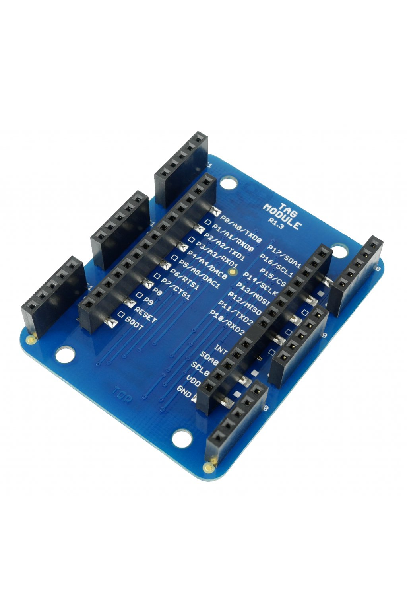

################
About Tag Module
################

The **Tag Module** makes it possible to **connect up to six HARDWARIO tags**.
There are two independent I²C buses (I2C0 and I2C1) - one on each side.
This allows to connect two tags of the same I²C address to a single HARDWARIO node.
It also features pull-up resistors on SDA/SCL signals of I2C1 bus.

.. note::

    Some HARDWARIO modules already have one or more extra 5-pin sockets allowing you to connect a HARDWARIO tag.
    But sometimes the number of positions is not enough, the socket is not available, or you need to extend the I²C bus with an additional channel.
    And that's when the Tag Module can help.

+-------------------------------------------------------+--------------------------------------------------------------------------------------------------+
| `E-Shop <https://shop.hardwario.com/tag-module/>`_    | `Schematic drawing <https://github.com/hardwario/bc-hardware/tree/master/out/bc-module-tag>`_    |
+-------------------------------------------------------+--------------------------------------------------------------------------------------------------+

********
Features
********

- 6x 5-pin socket position for HARDWARIO tag
- 3x tag positions are connected to I2C0 (right side)
- 3x tag positions are connected to I2C1 (left side)
- Integrated pull-up resistors on SDA/SCL signals of I2C1 bus
- Operating temperature range: -20 to 70 °C
- Mechanical dimensions: 44 x 55 mm

