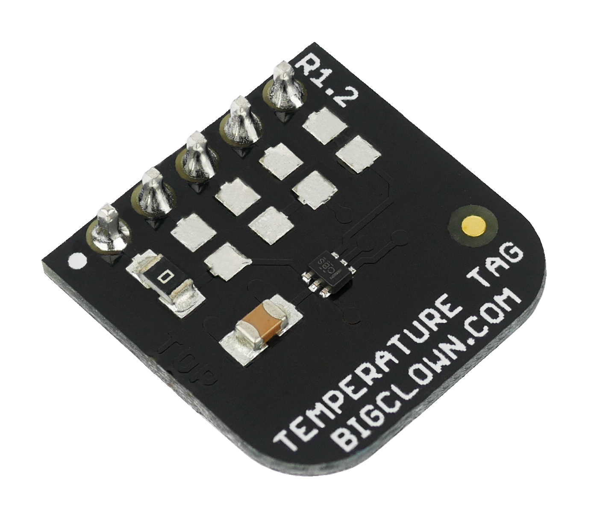

#####################
About Temperature Tag
#####################

The **Temperature Tag** uses a **high-accuracy temperature sensor TMP11** 2 with a typical accuracy of ±0.1 °C at 25 °C.
This sensor is digital and calibrated. It communicates using an I²C bus and features a very low power operation and shutdown mode.

+---------------------------------------------------------+----------------------------------------------------------------------------------------------------+------------------------------------------------------------------------+------------------------------------------------------------------------------------------------+------------------------------------------------------------------------------------------------+
| `E-Shop <https://shop.hardwario.com/temperature-tag/>`_ | `Schematic drawing <https://github.com/hardwario/bc-hardware/tree/master/out/bc-tag-temperature>`_ | `SDK Library <https://sdk.hardwario.com/group__bc__tag__temperature>`_ | `Header File <https://github.com/hardwario/bcf-sdk/blob/master/bcl/inc/bc_tag_temperature.h>`_ | `Source File <https://github.com/hardwario/bcf-sdk/blob/master/bcl/src/bc_tag_temperature.c>`_ |
+---------------------------------------------------------+----------------------------------------------------------------------------------------------------+------------------------------------------------------------------------+------------------------------------------------------------------------------------------------+------------------------------------------------------------------------------------------------+

********
Features
********

- Integrated temperature sensor TMP112 (TI)
- Communication using I²C bus
- Temperature accuracy (typical values):
    - ±0.1 °C at 25 °C
    - ±0.25 °C in the range from 0 °C to 65 °C
    - ±0.5 °C in the range from -40 °C to 125 °C
- 12-bit resolution (0.0625 °C)
- Optional interrupt output
- Power consumption:
    - 7 µA active current (4 Hz sample rate)
    - 0.5 µA shutdown current
- Operating voltage range: 1.4 V to 3.6 V
- Operating temperature range: -40 to 125 °C
- Mechanical dimensions: 16 x 16 mm

