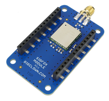

################
SigFox IoT Radio
################

Sigfox employs a proprietary technology that enables communication using the Industrial,
Scientific and Medical ISM radio band which uses 868MHz in Europe and 902MHz in the US.
It utilizes a wide-reaching signal that passes freely through solid objects, called "ultra narrowband" and requires little energy.

HARDWARIO has certified modem and tutorials to quickly get started.
