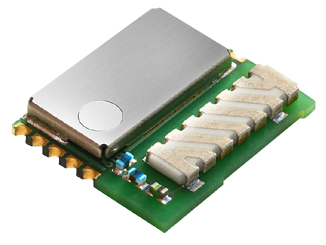

#############
Sub-GHz Radio
#############

The radio communication technology is the heart of the **HARDWARIO IoT Kit**. This document describes the basic operation of the radio.

With **our Iot Kit**, you can build your own network in the Sub-GHz band.

The radio frequency **868 MHz** (for Europe) or **915 MHz** (for the U.S.) allows long distance communication and offers low-power operation.
Since this frequency band is used for signal messages, you will not encounter interference with streaming protocols like WiFi, Bluetooth, etc.

.. note::

    HARDWARIO IoT Kit uses SPIRIT1 radio transceiver from STMicroelectronics.

*******************
Communication Range
*******************
We have done several radio communication tests. We claim, that from a single point,
you are typically able to provide a full-house radio coverage.

On the other hand, several factors influence the communication distance - the most important is the building material from which you have built your house,
obstacles in the path, interference from other appliances, etc.

The only objective radio communication range measurement is a so-called **line-of-sight** distance measured outdoor.

.. important::

    We've achieved more than `500 meters line-of-sight <https://www.youtube.com/watch?v=6zdQQdwV3GQ&feature=youtu.be>`_ communication range between two Core Modules.

    Also the single Radio Dongle / Core Module is enough to `cover three-story house and whole garden around it. <https://www.youtube.com/watch?v=JplQxCYSClA&feature=youtu.be>`_

On the other hand, if the radio communication range is not sufficient, the network can be expanded on IP level thanks to MQTT message replication to a master server.

.. note::

    You will need to search for ``connection``, ``address`` and ``topic`` directives in the ``mosquitto.conf`` configuration file.

**************
Radio Topology
**************
IoT Kit supports only **star network topology**. Such configuration offers high reliability,
easy troubleshooting and deterministic service time from batteries.

There are two types of devices in the HARDWARIO radio network:

- **Radio Dongle**
    You can pair up to 32 devices.

- **Radio Node**
    Every node has to be paired to the gateway. A node device can be some sensor (e.g. temperature, humidity, CO2) or actuator (power relay, LCD display, LED strip controller).

*************
Radio Pairing
*************
Pairing process is very straightforward procedure:

Step 1: The gateway device needs to be in the pairing mode
**********************************************************
.. note::

    The MQTT command for this operation is described in the document MQTT Topics.!!!!!!!!!!!!!!!TODO

    If you are using Playground, you can start it in the **Devices** Tab

Step 2: The node device has to transmit the pairing request
***********************************************************
This is done by cycling the power on the **node device**. On battery-operated node, you simple remove the batteries,
wait a few seconds (to get the capacitors discharged) and insert the batteries back.
The pairing request is sent on the boot.

Step 3: Once all node devices are enrolled, you have to exit the pairing mode
*****************************************************************************
.. note::

    The MQTT command for this operation is described in the document MQTT Topics.!!!!!!!!!!!!!!!TODO

    If you are using Playground, you can stop it in the **Devices** Tab

*****************************
Low Power Radio Communication
*****************************
All battery operated radio nodes have turned off the radio receiver when they are sleeping. The gateway is listening all the time.
This way it is very easy to send data anytime from battery operated node to the gateway.

The other way - communication from gateway to the remote node is a bit tricky.
Let's say you would like battery operated node with Relay Module which is bistable and needs energy only when changing its state.
There are a few solutions for this functionality:

**Using power adapter**

By using Power Module or micro USB cable to power Core Module constantly you can enable radio mode BC_RADIO_MODE_NODE_LISTENING in your firmware.

.. code-block:: c

    void application_init(void)
    {
        bc_radio_init(BC_RADIO_MODE_NODE_LISTENING);
    }

**Set listening timeout for sleeping node**
In the firmware you can set the time that the sleeping node will listen after every send message from Node to the Gateway.
You set it by calling bc_radio_set_rx_timeout_for_sleeping_node API.

This way let's say you send the measured temperature every 10 minutes and in your Node-RED or server code you will react to this
MQTT temperature message and immediately response with MQTT message to toggle the relay.
We did some tests and 400 ms is more then enough timeout for Node-RED to send the response MQTT message.

